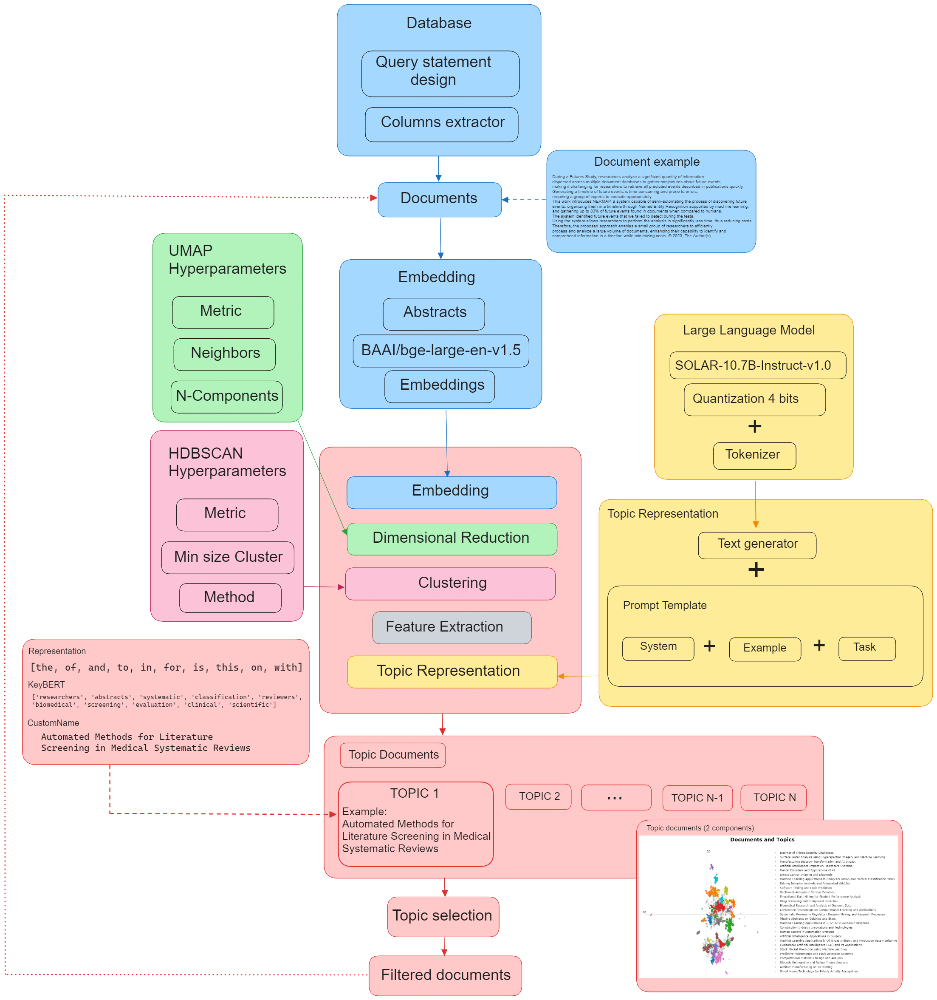

# **Topic Modeling with SOLAR-10.7B-Instruct-v1.0** ☀️
<br>

Let's explore how we can use SOLAR for Topic Modeling without the need to pass each document individually to the model. Instead, we'll leverage BERTopic, a topic modeling technique that can use any LLM to refine topic representations.

BERTopic operates in a fairly straightforward manner. It consists of 5 sequential steps: embedding documents, reducing the dimensionality of the embeddings, clustering the embeddings, tokenizing documents by cluster, and finally extracting the words that best represent each topic.

However, with the emergence of LLMs like **SOLAR**, we can do much better than simply having a set of independent words per topic. It's not computationally feasible to pass all documents directly to SOLAR and have it analyze them. We could employ vector databases for search, but we aren't sure exactly what topics to search for.

Instead, we will take advantage of the clusters and topics created by BERTopic and have SOLAR refine and distill that information into something more precise.

This approach combines the best of both worlds: the topic creation of BERTopic along with the topic representation of SOLAR.
<br>




## Getting Started

Before start install ```requirements.txt```

| Name  | Link  |
|---|---|
| **Topic Modeling using BERTopic and SOLAR ☀️**  | [](https://colab.research.google.com/drive/1KhcrFKpUjXIctm5ciO5dRhUrLn2NUsN1?usp=sharing)  |
| **Keywords Cosine Similarities**  | [](https://colab.research.google.com/drive/1jmC3ApWn-50GVD30lm0PJwwQT3StzoAi?usp=sharing)  |
| **Statistical Analysis** | (WIP) |
| **Data availability** (290.9 MB) | [](https://drive.google.com/file/d/1Mt5zca8B4RWhIsHwXmBV78h-QMflR_qF/view?usp=sharing) |


```bibtext
@article{gana2024topicreview,
  title={Leveraging LLMs for Efficient Topic Reviews},
  author={Gana,B.},
  journal={},
  year={2024}
}
```
This work is inspired by: https://github.com/MaartenGr/BERTopic
```bibtext
@article{grootendorst2022bertopic,
  title={BERTopic: Neural topic modeling with a class-based TF-IDF procedure},
  author={Grootendorst, Maarten},
  journal={arXiv preprint arXiv:2203.05794},
  year={2022}
}
```
